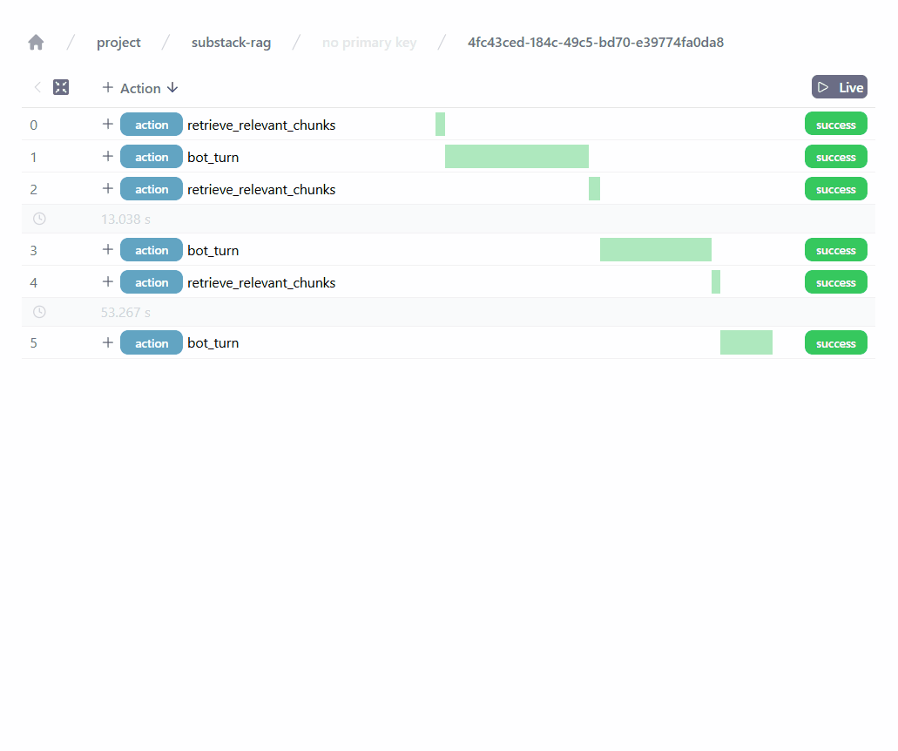

# Burr RAG with LanceDB and dlt document ingestion

This example shows how to build a chatbot with RAG over Substack blogs (or any RSS feed) stored into LanceDB.

> Burr UI brings a new level of observability to your RAG application via OpenTelemetry

Burr + [LanceDB](https://lancedb.github.io/lancedb/) constitute a powerful, but lightweight combo to build retrieval-augmented generative (RAG) agents. LanceDB makes it easy to swap embedding provider, and hides this concerns from the Burr application layer. For this example, we'll be using [OpenAI](https://github.com/openai/openai-python) for embedding and response generation.

By leveraging the [Burr integration with OpenTelemetry](https://blog.dagworks.io/p/building-generative-ai-agent-based), we get full visibility into the OpenAI API requests/responses and the LanceDB operations for free.

To ingest data, we use [dlt and its LanceDB integration](https://dlthub.com/devel/dlt-ecosystem/destinations/lancedb), which makes it very simple to query, embed, and store blogs from the web into LanceDB tables.

## Content

- `notebook.ipynb` contains a tutorial
- `application.py` has the `burr` code for the chatbot
- `ingestion.py` has the `dlt` code for document ingestion
- `utils.py` contains functions utility functions to setup `OpenTelemetry` instrumentation and environment variables
